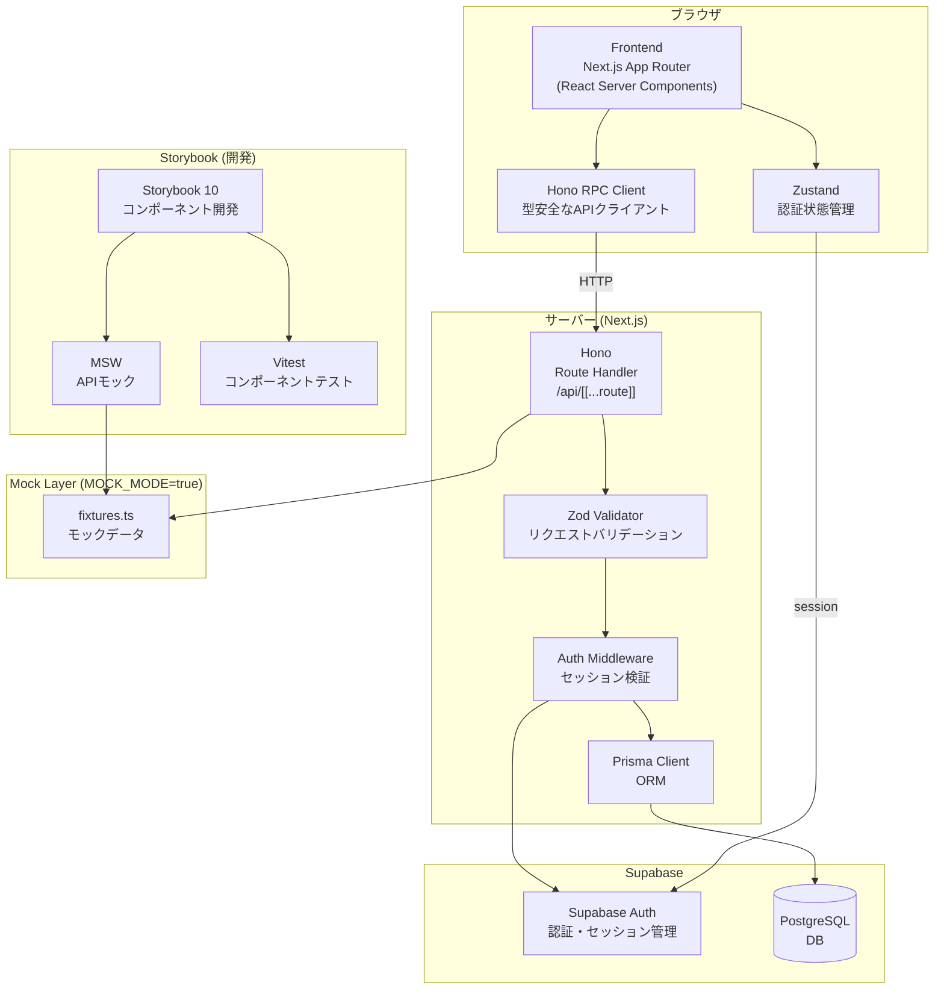
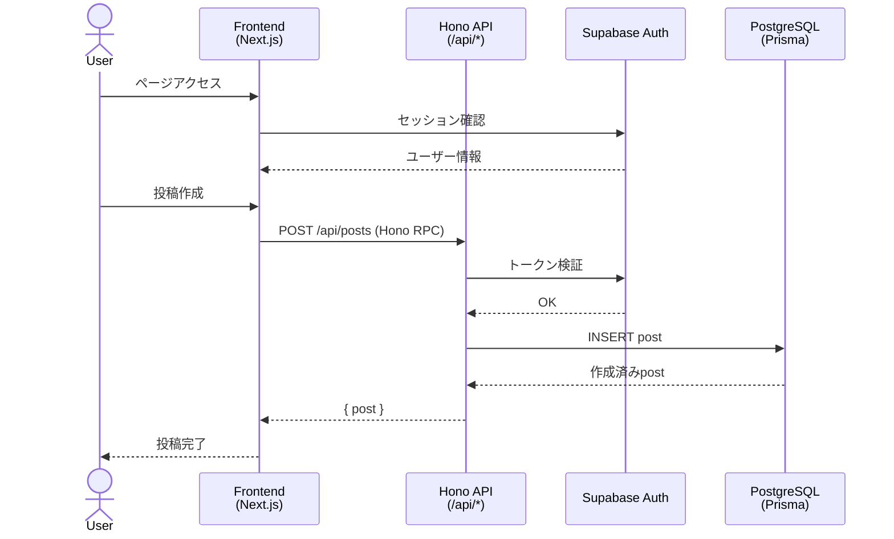
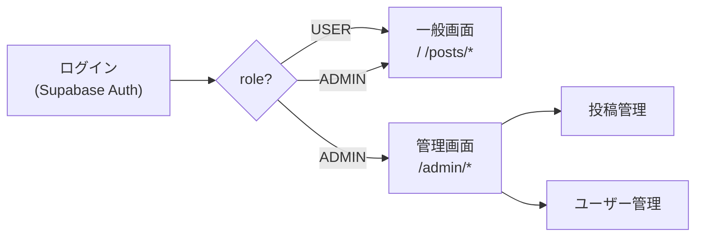

# Architecture

```mermaid
graph TB
  subgraph Browser["ブラウザ"]
    UI["Frontend\nNext.js App Router\n(React Server Components)"]
    RPC["Hono RPC Client\n型安全なAPIクライアント"]
    ZS["Zustand\n認証状態管理"]
    UI --> RPC
    UI --> ZS
  end

  subgraph Server["サーバー (Next.js)"]
    NH["Hono\nRoute Handler\n/api/[[...route]]"]
    ZV["Zod Validator\nリクエストバリデーション"]
    AM["Auth Middleware\nセッション検証"]
    PR["Prisma Client\nORM"]
    NH --> ZV --> AM --> PR
  end

  subgraph Supabase["Supabase"]
    SA["Supabase Auth\n認証・セッション管理"]
    DB[("PostgreSQL\nDB")]
    PR --> DB
    AM --> SA
  end

  subgraph Storybook["Storybook (開発)"]
    SB["Storybook 10\nコンポーネント開発"]
    MSW["MSW\nAPIモック"]
    VT["Vitest\nコンポーネントテスト"]
    SB --> MSW
    SB --> VT
  end

  subgraph Mock["Mock Layer (MOCK_MODE=true)"]
    FX["fixtures.ts\nモックデータ"]
    NH --> FX
    MSW --> FX
  end

  RPC -->|"HTTP"| NH
  ZS -->|"session"| SA
```

## データフロー

```mermaid
sequenceDiagram
  actor User
  participant FE as Frontend<br/>(Next.js)
  participant API as Hono API<br/>(/api/*)
  participant Auth as Supabase Auth
  participant DB as PostgreSQL<br/>(Prisma)

  User->>FE: ページアクセス
  FE->>Auth: セッション確認
  Auth-->>FE: ユーザー情報

  User->>FE: 投稿作成
  FE->>API: POST /api/posts (Hono RPC)
  API->>Auth: トークン検証
  Auth-->>API: OK
  API->>DB: INSERT post
  DB-->>API: 作成済みpost
  API-->>FE: { post }
  FE-->>User: 投稿完了
```

## ロール制御

```mermaid
flowchart LR
  Login["ログイン\n(Supabase Auth)"] --> Check{"role?"}
  Check -->|USER| UserUI["一般画面\n/ /posts/*"]
  Check -->|ADMIN| UserUI
  Check -->|ADMIN| AdminUI["管理画面\n/admin/*"]
  AdminUI --> PostMgmt["投稿管理"]
  AdminUI --> UserMgmt["ユーザー管理"]
```
