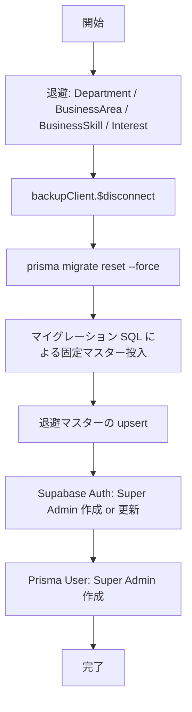

# `db:reset` 仕様

開発用データベースリセットコマンド `npm run db:reset -- --confirm-reset`（`scripts/reset-db.ts`）の、消えるデータと残るデータの一覧。

## 前提

| 項目 | 内容 |
|------|------|
| コマンド | `npm run db:reset -- --confirm-reset` |
| 対象 | PostgreSQL（Prisma 管理）＋ Super Admin の Supabase Auth |
| ブロック条件 | `--confirm-reset` なし、または `NODE_ENV=production` |
| 対象外 | Supabase Storage（アバター・画像ファイルなど）は触らない |

## 処理の流れ



---

## 消えるデータ（復元されない）

`migrate reset` でスキーマごと DROP され、スクリプトでも復元しないもの。

### ユーザーデータ

| テーブル | 内容 |
|----------|------|
| `User` | 全ユーザー（Super Admin を除く） |
| `UserBusinessSkill` | ユーザーとビジネススキルの紐づけ |
| `UserInterest` | ユーザーと興味の紐づけ |
| `HirobaMembership` | ひろば参加（後述の Super Admin 分を除く） |
| `Invite` | 招待トークン |
| `PasswordReset` | パスワードリセットトークン |

### 質問（QA）

| テーブル | 内容 |
|----------|------|
| `Post` | 質問 |
| `Answer` | 回答 |
| `PostAnonymousProfile` | スレッド内の匿名キャラ割り当て |
| `QuestionLike` / `AnswerLike` / `PostBookmark` | いいね・ブックマーク |
| `PostTag` | 質問へのタグ付与 |
| `Notification`（QA 関連） | 通知 |

### ひろば

| テーブル | 内容 |
|----------|------|
| `HirobaPost` | ひろば投稿 |
| `HirobaAnswer` | ひろば回答 |
| `HirobaPostLike` / `HirobaAnswerLike` / `HirobaPostBookmark` | リアクション |
| `HirobaPostTag` | ひろば投稿へのタグ付与 |
| `Notification`（ひろば関連） | 通知 |

### その他

| テーブル | 内容 |
|----------|------|
| `AnonymousProfile` | 匿名キャラマスター（シードなし） |
| `AiFlag` | AI フラグ |

### Supabase Auth（注意）

| 対象 | 挙動 |
|------|------|
| Super Admin 以外の Auth ユーザー | **Supabase 上には残る**が、Prisma の `User` 行は消えるため **DB と不整合**になる |
| Super Admin | 後述のとおり更新 or 再作成 |

Storage 上のファイル（匿名キャラアバター、ひろば投稿画像など）も削除されない。DB だけ空になる。

---

## 残る・復元されるデータ

### 1. マイグレーションで再投入される固定マスター

`prisma migrate reset` により全マイグレーションが再適用され、データ投入 SQL があるものは毎回入り直す。

| テーブル | 投入元 | 内容 |
|----------|--------|------|
| `Hiroba` | 各マイグレーション | 固定カタログ全 slug（`lib/hiroba/catalog.ts` と対応。`feature-testing` 含む） |
| `TagCategory` | `20260820000000_sync_ai_tag_master_data` ほか | 正規6カテゴリ（社内ルール・手続き 〜 その他） |
| `Tag` | 同上 | 正規18タグ（勤怠・有給関連 〜 その他（雑談に近い質問）） |
| `BusinessSkill` | 同上 | 正規5件（社内ルール・手続き 〜 IBJマインド・キャリア）。正規以外は DELETE される |

マイグレーション時点では `User` が存在しないため、`HirobaMembership` の一括登録 SQL は **0 件**になる。

### 2. リセット前に退避して upsert するマスター

リセット直前の `findMany()` 結果を `name` 一致で upsert する。`isActive` と `sortOrder` は退避値を反映する。

| テーブル | 復元の詳細 |
|----------|------------|
| `Department` | 行ごと復元（`id` 含む）。リセット前が空なら空のまま |
| `BusinessArea` | 同上 |
| `Interest` | 同上 |
| `BusinessSkill` | 正規5件はマイグレーションの **md5 `id` が残り**、属性だけ退避値で上書き。管理画面で追加したカスタム件は `create` で **退避した `id` ごと復元** |

`BusinessSkill` だけ、固定カタログ（マイグレーション）と運用マスター（退避復元）の二重扱いになる。詳細は下記「既知の挙動」。

### 3. スクリプトが新規作成するデータ

| 対象 | 内容 |
|------|------|
| Supabase Auth | `superadmin@yoriai.dev`（存在すればパスワード・ロール更新、なければ作成） |
| `User` | Super Admin 1 名（`role: ADMIN`、`onboardingCompletedAt` 済み） |
| `HirobaMembership` | Super Admin → `feature-testing` のみ |

#### Super Admin 固定値

| 項目 | 値 |
|------|-----|
| メール | `superadmin@yoriai.dev` |
| パスワード | `.env.local` の `SUPER_ADMIN_PASSWORD`（開発用の例: `Admin@1234`） |
| 表示名 | `Super Admin` |
| ユーザー名 | `管理者` |

---

## リセット後の DB 状態（まとめ）

| カテゴリ | リセット後 |
|----------|------------|
| ユーザー | Super Admin のみ |
| 質問・回答・ひろば投稿 | なし |
| 匿名キャラ | なし |
| 部署・事業領域・興味 | リセット前と同じ（空の可能性あり） |
| ビジネススキル | 正規5件 ＋ リセット前のカスタム追加分 |
| タグ | 正規18件（マイグレーション由来） |
| ひろばマスター | 固定カタログ全件 |
| ひろばメンバーシップ | Super Admin の `feature-testing` のみ |

---

## 既知の挙動・注意点

### Prisma Client は reset 前後で別インスタンス

退避読み取り用クライアントは `$disconnect()` してから `migrate reset` する。書き戻しは新しいクライアントで行う。同一クライアントの使い回しはしない。

### `prisma generate` は import 前に1回のみ

`migrate reset` 自体も `generate` を実行する。reset 後に同一プロセスで再度 `generate` しても、読み込み済みクライアントには反映されないため行わない。

### Supabase Auth の孤立ユーザー

`db:reset` は Super Admin の Auth だけ更新・作成する。それ以外の Auth ユーザーは **Supabase 上に残り**、Prisma の `User` 行だけ消えるため不整合になる。

Storage のように CLI で一括削除するコマンドはない。不要な Auth ユーザーは **ダッシュボードで個別削除**する。

1. [Supabase Dashboard](https://supabase.com/dashboard) → 対象プロジェクト
2. **Authentication** → **Users**
3. 削除したいユーザーの行を開き、**Delete user**（またはメニューから削除）

`superadmin@yoriai.dev` は次回 `db:reset` で再作成される。完全に消したい場合だけ手動削除すればよい。

Storage のオブジェクトを所有しているユーザーは削除に失敗することがある。その場合は先に下記の Storage 削除を行う。

### Storage と DB の不整合

匿名キャラアバターや投稿画像は Storage に残るが、参照する DB 行は消える。完全にきれいなローカル環境にしたい場合は、`db:reset` のあと Storage も手動で空にする。

Supabase CLI でバケット内を再帰削除する:

```bash
supabase storage rm -r profiles
supabase storage rm -r posts
```

| バケット | 主な内容 |
|----------|----------|
| `profiles` | ユーザーアバター（`{userId}.webp`）、匿名キャラ画像（`anonymous-profiles/...`） |
| `posts` | ひろば投稿画像（`hiroba-posts/{postId}.webp`） |

`public/anonymous-profiles/*.svg` などリポジトリ内の静的アセットは Storage ではないため、このコマンドの対象外。

リモートプロジェクトを対象にする場合は `--linked` や `--project-ref` など、普段使っている Supabase CLI の接続オプションを付ける。

### 開発環境をきれいに戻す手順（まとめ）

| 順番 | 操作 | 対象 |
|------|------|------|
| 1 | `npm run db:reset -- --confirm-reset` | PostgreSQL + Super Admin Auth |
| 2 | `supabase storage rm -r profiles` / `posts` | Storage |
| 3 | Dashboard → Authentication → Users で個別削除 | 孤立した Auth ユーザー |

### 本番では実行不可

`NODE_ENV=production` ではスクリプトが拒否する。本番データの初期化には使わない。

---

## 関連ファイル

| ファイル | 役割 |
|----------|------|
| `scripts/reset-db.ts` | リセットスクリプト本体 |
| `package.json` | `db:reset` スクリプト定義 |
| `prisma/migrations/` | 固定マスターの投入 SQL |
| `lib/hiroba/catalog.ts` | ひろば固定カタログ定義 |
| `tests/hiroba-catalog.test.ts` | カタログとマイグレーション seed の対応テスト |
| `tests/mocks/tag-master-data.test.ts` | タグ・ビジネススキル正規データのテスト |
