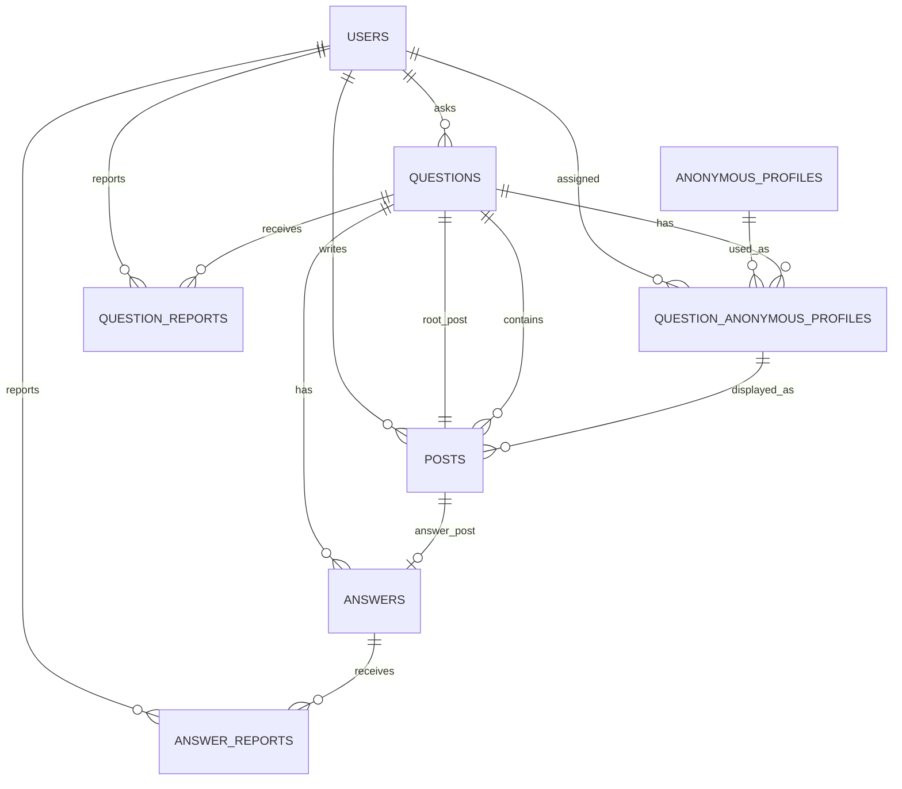

# 質問機能：DB設計仮説（`posts` 採用案）

## この資料の目的

質問・回答・匿名表示・通報を扱うためのデータ構造を、実装前の設計仮説として整理する。次回MTGでは、細かなカラムを確定するのではなく、`posts` を中心にしたテーブル分割と匿名性の扱いが妥当かを相談したい。

## 現在の確度

| 項目 | 状態 |
| --- | --- |
| この資料 | 実装前の設計案。テーブル名・カラム・制約は未確定 |
| 現行DB | 汎用の `Post` モデルのみが存在する |
| 質問機能用モデル | 未実装。現行の `Post` との統合・移行方法も未決定 |
| 検索 | MVPでは通常テーブルから質問タイトル・本文を検索する案 |

## 設計の考え方

### 質問と回答の共通部分を `posts` にまとめる

質問本文と回答本文は、どちらもユーザーが投稿する本文である。本文、実投稿者、匿名表示、非表示状態、作成・更新日時は共通の `posts` にまとめる。

質問だけに必要なタイトル、状態、回答数、解決日時は `questions` に置く。

**この構成にする理由**

- 質問・回答の投稿情報を同じ考え方で扱える。
- 匿名表示と非表示の処理を投稿単位でそろえられる。
- 将来、回答本文も検索対象にしやすい。
- 管理画面で質問・回答を横断して扱いやすい。

### 匿名キャラは質問スレッドごとに割り当てる

同じ質問の中では、同じユーザーを同じ匿名キャラとして表示する。別の質問では別の匿名キャラになってよい。

**この構成にする理由**

- スレッド内では誰がどの回答をしたかを追える。
- 質問をまたいで同一人物を特定しにくくできる。
- 実ユーザー情報は投稿に保持し、管理者だけが確認できる。

## テーブル案

### `users`

既存ユーザーを参照する。質問機能のために新設するテーブルではない。

| 主な項目 | 用途 |
| --- | --- |
| `id` | 実ユーザーを識別する |
| `role` | 管理者かどうかを判定する |

**関係：** 質問の投稿者、回答の投稿者、通報者、非表示操作を行う管理者を表す。

### `anonymous_profiles`

匿名キャラのマスタを持つ。

| 主な項目 | 用途 |
| --- | --- |
| `id` | 匿名プロフィールを識別する |
| `display_name` | 画面に表示する匿名名 |
| `avatar_url` | 画面に表示するアイコン |
| `is_active` | 新しい割り当ての候補にするか |

**このテーブルを分ける理由：** 匿名名やアイコンを投稿ごとに保存せず、表示用のキャラを管理しやすくするため。

### `questions`

質問スレッドそのものを表す。

| 主な項目 | 用途 |
| --- | --- |
| `id` | 質問を識別する |
| `author_user_id` | 質問者。解決済み操作の権限確認に使う |
| `root_post_id` | 質問本文を持つ `posts` を指す |
| `title` | 質問タイトル |
| `status` | 質問の状態 |
| `answer_count` | 表示中の回答数 |
| `resolved_at` | 解決済みにした日時 |

**このテーブルを分ける理由：** タイトルや解決状態は質問だけの属性であり、回答には持たせないため。

#### `status` の案

| 値 | 意味 |
| --- | --- |
| `open` | 未回答。回答を受け付ける |
| `answered` | 回答あり。回答を受け付ける |
| `resolved` | 解決済み。追加回答を受け付けない |
| `hidden` | 管理者により非表示 |

### `posts`

質問本文・回答本文に共通する投稿情報を持つ。

| 主な項目 | 用途 |
| --- | --- |
| `id` | 投稿を識別する |
| `question_id` | 所属する質問スレッド |
| `author_user_id` | 実投稿者。一般ユーザーには表示しない |
| `question_anonymous_profile_id` | スレッド内で表示する匿名キャラ |
| `type` | `question` または `answer` |
| `body` | 質問本文または回答本文 |
| `is_hidden` | 投稿単位の非表示状態 |
| `hidden_at` / `hidden_by_user_id` / `hidden_reason` | 非表示の監査情報 |

**このテーブルを置く理由：** 質問と回答に重なる情報を一か所で管理し、匿名表示・通報対応・検索の拡張をそろえるため。

### `answers`

ある投稿が「回答」であることを表す薄いテーブルとする。

| 主な項目 | 用途 |
| --- | --- |
| `id` | 回答を識別する |
| `question_id` | 対象質問 |
| `post_id` | 回答本文を持つ `posts` |

**このテーブルを置く理由：** 回答をIDで参照しやすくし、回答向けの通報や将来の回答固有機能を追加しやすくするため。回答本文・投稿者は `posts` に持たせる。

### `question_anonymous_profiles`

質問スレッドごとの「実ユーザーと匿名キャラ」の対応を持つ。

| 主な項目 | 用途 |
| --- | --- |
| `id` | 割り当てを識別する。`posts` から参照する |
| `question_id` | 質問スレッド |
| `user_id` | 実ユーザー |
| `anonymous_profile_id` | 表示する匿名キャラ |

**必要な制約案**

| 制約 | 守りたいこと |
| --- | --- |
| `unique(question_id, user_id)` | 同じ質問内で同じユーザーには同じ匿名キャラを表示する |
| `unique(question_id, anonymous_profile_id)` | 同じ質問内で複数ユーザーが同じ匿名キャラにならないようにする |

### `question_reports`

質問への通報を持つ。

| 主な項目 | 用途 |
| --- | --- |
| `question_id` | 通報対象の質問 |
| `reporter_user_id` | 通報したユーザー |
| `reason` / `detail` | 通報理由と補足 |
| `status` | `pending`、`reviewing`、`resolved`、`rejected` の対応状況 |
| `handled_by_user_id` / `handled_at` | 対応した管理者と日時 |

### `answer_reports`

回答への通報を持つ。

| 主な項目 | 用途 |
| --- | --- |
| `answer_id` | 通報対象の回答 |
| `reporter_user_id` | 通報したユーザー |
| `reason` / `detail` | 通報理由と補足 |
| `status` | 対応状況 |
| `handled_by_user_id` / `handled_at` | 対応した管理者と日時 |

**通報テーブルを分ける理由：** MVPでは質問と回答の対象を明示して管理したい。将来、共通の通報テーブルに統合するかは実装・運用の複雑さを見て判断する。

## テーブル間の関係

## 主な処理とデータの動き

### 質問を投稿する

1. `questions` に質問スレッドを作る。
2. 質問者の `question_anonymous_profiles` を作る、または取得する。
3. `posts` に質問本文を作る。
4. `questions.root_post_id` に質問本文を設定する。
5. 質問の状態を `open` にする。

### 回答を投稿する

1. 質問が `open` または `answered` か確認する。
2. 回答者の匿名キャラをスレッド内で取得または割り当てる。
3. `posts` に回答本文を作る。
4. `answers` に回答としての参照を作る。
5. 回答数を増やし、必要に応じて状態を `answered` にする。

### 質問を解決済みにする

1. 操作ユーザーが質問者かを確認する。
2. `questions.status` を `resolved` にする。
3. `resolved_at` を記録する。
4. 以後の回答投稿を受け付けない。

### 管理者が非表示にする

質問を非表示にする場合は質問の状態と質問本文の投稿を非表示にする。回答を非表示にする場合は対象の投稿を非表示にし、回答数と質問状態を必要に応じて再計算する。

## 検索の考え方

MVPでは `questions.title` と質問本文の `posts.body` を対象にする。回答本文検索は、検索結果に何を表示するかを決めてから追加する。

想定するインデックスは、質問状態・更新日時、質問タイトル、質問IDと投稿種別・作成日時、投稿本文、匿名キャラ割り当ての一意制約、通報の状態・作成日時である。DB製品に合わせた具体的な方式は実装時に決める。

検索専用テーブルはMVPで作らない。詳細は[検索専用テーブル拡張案](./question-feature-search-document-design.md)を参照する。

## MTGで確認したいこと

1. 質問・回答の共通部分を `posts` にまとめる構成でよいか。
2. 匿名キャラを質問スレッドごとに固定するルールでよいか。
3. `answers` を薄いテーブルとして分ける必要があるか。
4. 解決済み後は追加回答を受け付けないルールでよいか。
5. 現行の汎用 `Post` モデルをどのように質問機能へ統合するかは、要件合意後に検討する方針でよいか。
