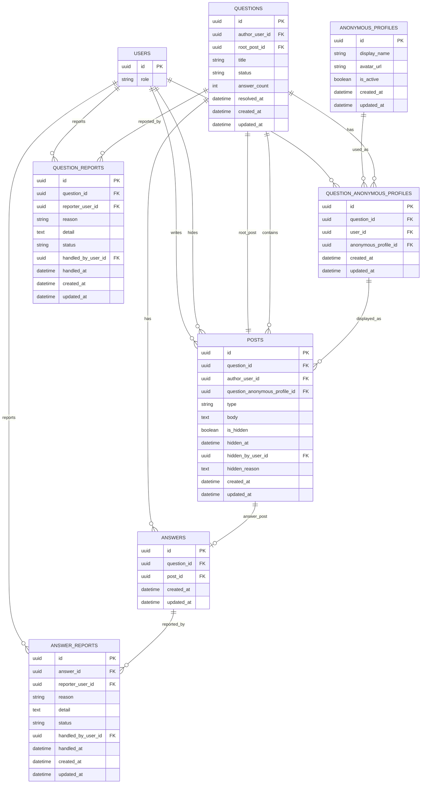

# 質問機能 MVP DB設計プラン（posts採用案）

## このドキュメントの位置づけ

`docs/question-feature-mvp-plan.md` の MVP 対象機能に限定し、質問・回答を共通の「投稿」として扱う `posts` テーブル採用方針で DB 設計を整理する。

検索は、MVP初期では質問タイトル・質問本文を対象にする。回答本文を検索対象に含める場合も、基本スキーマは変えずに、検索API、SQLクエリ、レスポンス、検索結果UIを調整する。

検索専用テーブルを使う将来拡張案は、別紙 `docs/question-feature-search-document-design.md` にまとめる。

---

## MVPで扱う範囲

MVPで扱う機能は、質問投稿、質問一覧、質問詳細、回答投稿、全社員回答、匿名キャラ表示、管理者による実ユーザー確認、質問ステータス、解決済みにする機能、キーワード検索、未回答フィルター、解決済みフィルター、通報、管理者非表示とする。

MVPでは、カテゴリ、タグ、参考になった、いいね、人気表示、ベストアンサー、通知、メンション、ランキング、部署限定公開、回答者指名、AI回答は扱わない。

---

## 設計方針

### `posts` を作る理由

質問本文と回答本文は、どちらも「ユーザーが投稿した本文」である。

そのため、本文、投稿者、匿名表示、非表示状態、作成日時、更新日時などの共通情報を `posts` に集約する。

`posts` 側に `body` を持つ理由は以下。

1. 質問本文と回答本文を同じ「投稿本文」として扱える。
2. 匿名プロフィール割り当てを投稿単位で一貫して参照できる。
3. 管理画面で質問本文・回答本文を横断して検索しやすい。
4. 将来、回答本文も検索対象に拡張しやすい。
5. 質問・回答の非表示処理を投稿単位に寄せられる。

一方で、質問特有の `title`、`status`、`answer_count`、`resolved_at` は `questions` に置く。

### 匿名プロフィール割り当て

匿名プロフィールは、質問スレッドごとに割り当てる。

同じ質問スレッド内では、同じユーザーに同じ `anonymous_profiles` を表示する。別の質問スレッドでは、同じユーザーでも別の匿名プロフィールになってよい。

このために `question_anonymous_profiles` を用意する。

### 解決済み後の回答

`questions.status = resolved` になった質問には、追加回答できない。

Yahoo知恵袋の回答締め切りに近い考え方として、質問者が手動で解決済みにした時点で回答受付を終了する。

### `status` はDBに保存する

`questions.status` はDBに保存する。

質問者が手動で設定する状態であり、未回答・回答あり・解決済み・非表示のフィルターにも使うため、都度計算ではなく永続化する。

---

## 推奨テーブル構成

### `users`

既存ユーザーテーブルを参照する想定。

| カラム | 用途 |
| --- | --- |
| `id` | ユーザーID |
| `role` | 管理者判定に利用 |

### `anonymous_profiles`

匿名キャラのマスタ。

| カラム | 用途 |
| --- | --- |
| `id` | 匿名プロフィールID |
| `display_name` | 匿名表示名 |
| `avatar_url` | 匿名サムネイルURL |
| `is_active` | 新規割り当て対象にするか |
| `created_at` | 作成日時 |
| `updated_at` | 更新日時 |

### `questions`

質問スレッドを表すテーブル。

| カラム | 用途 |
| --- | --- |
| `id` | 質問ID |
| `author_user_id` | 質問者。解決済み操作の権限確認に利用 |
| `root_post_id` | 質問本文を持つ `posts.id`。作成直後に設定する |
| `title` | 質問タイトル |
| `status` | `open`, `answered`, `resolved`, `hidden` |
| `answer_count` | 表示中の回答数 |
| `resolved_at` | 解決済みにした日時 |
| `created_at` | 作成日時 |
| `updated_at` | 更新日時 |

#### `questions.status`

| 値 | 意味 |
| --- | --- |
| `open` | 未回答 |
| `answered` | 回答あり |
| `resolved` | 解決済み。追加回答不可 |
| `hidden` | 管理者非表示 |

### `posts`

質問本文・回答本文を共通で管理する投稿テーブル。

| カラム | 用途 |
| --- | --- |
| `id` | 投稿ID |
| `question_id` | 所属する質問スレッドID |
| `author_user_id` | 実投稿者。一般ユーザーには表示しない |
| `question_anonymous_profile_id` | スレッド内匿名プロフィール割り当てID |
| `type` | `question` または `answer` |
| `body` | 投稿本文 |
| `is_hidden` | 投稿単位の非表示フラグ |
| `hidden_at` | 非表示日時 |
| `hidden_by_user_id` | 非表示にした管理者 |
| `hidden_reason` | 非表示理由 |
| `created_at` | 作成日時 |
| `updated_at` | 更新日時 |

`posts.body` に質問本文と回答本文を置くことで、質問・回答を横断した投稿管理と検索拡張がしやすくなる。

### `answers`

回答であることを表すテーブル。

| カラム | 用途 |
| --- | --- |
| `id` | 回答ID |
| `question_id` | 対象質問ID |
| `post_id` | 回答本文を持つ `posts.id` |
| `created_at` | 作成日時 |
| `updated_at` | 更新日時 |

回答本文や投稿者は `posts` に持たせるため、`answers` は薄いテーブルにする。

### `question_anonymous_profiles`

質問スレッド内で、実ユーザーと匿名プロフィールの対応を管理するテーブル。

| カラム | 用途 |
| --- | --- |
| `id` | 主キー。`posts.question_anonymous_profile_id` から参照される |
| `question_id` | 質問スレッドID |
| `user_id` | 実ユーザーID |
| `anonymous_profile_id` | 匿名プロフィールID |
| `created_at` | 作成日時 |
| `updated_at` | 更新日時 |

#### 主キーと制約

- 主キーは `id` とする。
- `posts.question_anonymous_profile_id` は、この `id` を外部キーとして参照する。
- `unique(question_id, user_id)` を付ける。
- `unique(question_id, anonymous_profile_id)` を付ける。

`unique(question_id, user_id)` により、同じ質問スレッド内では同じユーザーに同じ匿名プロフィールだけが割り当たる。

`unique(question_id, anonymous_profile_id)` により、同じ質問スレッド内で複数ユーザーが同じ匿名プロフィールになることを避ける。

### `question_reports`

質問への通報。

| カラム | 用途 |
| --- | --- |
| `id` | 通報ID |
| `question_id` | 通報対象質問ID |
| `reporter_user_id` | 通報者 |
| `reason` | 通報理由 |
| `detail` | 補足説明 |
| `status` | `pending`, `reviewing`, `resolved`, `rejected` |
| `handled_by_user_id` | 対応した管理者 |
| `handled_at` | 対応日時 |
| `created_at` | 通報日時 |
| `updated_at` | 更新日時 |

### `answer_reports`

回答への通報。

| カラム | 用途 |
| --- | --- |
| `id` | 通報ID |
| `answer_id` | 通報対象回答ID |
| `reporter_user_id` | 通報者 |
| `reason` | 通報理由 |
| `detail` | 補足説明 |
| `status` | `pending`, `reviewing`, `resolved`, `rejected` |
| `handled_by_user_id` | 対応した管理者 |
| `handled_at` | 対応日時 |
| `created_at` | 通報日時 |
| `updated_at` | 更新日時 |

---

## ER図

---

## 検索方針

### MVP初期の検索対象

MVP初期の検索対象は以下にする。

- `questions.title`
- `posts.body` のうち `posts.type = question` のもの

つまり、質問タイトルと質問本文を検索する。

回答本文も `posts.body` に保存されるため、将来的に回答本文を検索対象へ含める場合でも、`questions`、`posts`、`answers`、`question_anonymous_profiles` の基本スキーマは変えずに済む。

### 回答本文検索へ広げる場合

回答本文も検索対象にする場合は、検索APIの実装を変更する。

主な変更点は以下。

1. SQLクエリで `posts.type = answer` も検索対象に含める。
2. 回答本文がヒットしたときのレスポンス形式を決める。
3. 検索結果に質問を出すのか、回答の抜粋も出すのかを決める。
4. 必要に応じて、回答本文検索用のインデックスを調整する。

このため、検索対象を広げるとAPI実装やSQLクエリは変わる。ただし、本文を `posts.body` に集約しているため、DBの基本スキーマは変えない前提で拡張できる。

### インデックス方針

| テーブル | インデックス | 目的 |
| --- | --- | --- |
| `questions` | `(status, updated_at)` | 未回答・解決済みフィルターと一覧 |
| `questions` | full-text index on `title` | タイトル検索 |
| `posts` | `(question_id, type, created_at)` | 質問詳細・回答一覧 |
| `posts` | full-text index on `body` | 質問本文検索。将来の回答本文検索にも利用可能 |
| `question_anonymous_profiles` | unique `(question_id, user_id)` | スレッド内の同一ユーザー同一匿名表示 |
| `question_anonymous_profiles` | unique `(question_id, anonymous_profile_id)` | スレッド内の匿名プロフィール重複防止 |
| `question_reports` | `(status, created_at)` | 管理画面の通報一覧 |
| `answer_reports` | `(status, created_at)` | 管理画面の通報一覧 |

### 検索設計のまとめ

MVP初期では、質問タイトル・質問本文検索から始める。

回答本文検索は、基本スキーマを変えずに後から追加できる。ただし、API、SQL、レスポンス、検索結果UIは変わるため、利用状況を見てから具体化する。

検索専用テーブルは、質問数・回答数・検索要件が増えてから追加検討する。

---

## 主要ユースケース

### 質問投稿

1. `questions.author_user_id` に質問者を入れて `questions` を作成する。
2. 質問者用の `question_anonymous_profiles` を作成する。
3. `posts.type = question`、`posts.body = 質問本文` の投稿を作成する。
4. `questions.root_post_id` に質問本文投稿の `posts.id` を設定する。

`questions.root_post_id` と `posts.question_id` は相互参照になるため、実装時は `questions` 作成後に `posts` を作り、最後に `questions.root_post_id` を更新する流れにする。
5. `questions.status = open` にする。

### 回答投稿

1. 対象質問の `questions.status` を確認する。
2. `resolved` または `hidden` の場合は回答不可にする。
3. 回答者の `question_anonymous_profiles` がなければ作成する。
4. `posts.type = answer` の投稿を作成する。
5. `answers` を作成して `post_id` を紐づける。
6. `questions.answer_count` を増やす。
7. `questions.status = open` であれば `answered` に更新する。

### 解決済みにする

1. 操作ユーザーが質問者であることを確認する。
2. `questions.status = resolved` に更新する。
3. `questions.resolved_at = now()` に更新する。
4. 以後、回答投稿を不可にする。

### 管理者が非表示にする

質問を非表示にする場合は、`questions.status = hidden` にする。質問本文の `posts.is_hidden` も `true` にする。

回答を非表示にする場合は、回答に紐づく `posts.is_hidden = true` にする。必要に応じて `questions.answer_count` と `questions.status` を再計算する。

### 通報する

質問への通報は `question_reports` に作成する。

回答への通報は `answer_reports` に作成する。

---

## 現時点の推奨

MVP初期は、質問タイトル・質問本文検索から始めるのがよい。

理由は以下。

1. MVP要件のキーワード検索は、質問タイトル・本文検索で満たせる。
2. `posts.body` に本文を集約しておけば、後から回答本文検索に広げやすい。
3. 回答本文検索のレスポンスや検索結果UIは、利用状況を見てから設計した方がよい。
4. 検索専用テーブルは後から追加できる。
