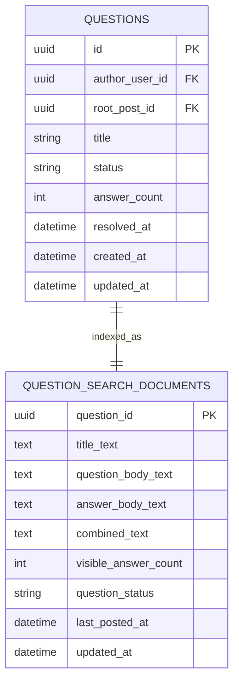

# 質問機能 検索専用テーブル拡張案

## このドキュメントの位置づけ

このドキュメントは、質問機能の検索性能や検索体験を強化するために、将来的に検索専用テーブルを導入する場合のイメージをまとめる。

MVP初期では必須ではない。`questions` と `posts` の通常テーブルに対する検索から開始し、質問数・回答数・検索要件が増えた段階で追加検討する。

---

## 検索専用テーブルとは

検索専用テーブルとは、通常の登録・表示で使うメインテーブルとは別に、検索しやすい形へデータをまとめ直したテーブルである。

質問機能では、質問タイトル、質問本文、回答本文を質問スレッド単位でまとめた検索用データを持つイメージになる。

---

## 後から実装できるか

検索専用テーブルは後から実装できる。

理由は、検索専用テーブルが元データではなく、`questions`、`posts`、`answers` から作れる派生データだからである。

MVP初期は通常テーブルだけで検索し、あとから以下の手順で追加できる。

1. 検索専用テーブルを追加する。
2. 既存の質問・投稿データから検索専用テーブルをバックフィルする。
3. 質問投稿・回答投稿・編集・非表示時に検索専用テーブルを更新する処理を追加する。
4. 検索APIの参照先を通常テーブル検索から検索専用テーブルへ切り替える。

---

## テーブル案

### `question_search_documents`

質問スレッド単位の検索用ドキュメント。

| カラム | 用途 |
| --- | --- |
| `question_id` | 主キー。対象質問ID |
| `title_text` | 質問タイトル検索用テキスト |
| `question_body_text` | 質問本文検索用テキスト |
| `answer_body_text` | 回答本文検索用テキスト |
| `combined_text` | タイトル・質問本文・回答本文をまとめた検索用テキスト |
| `visible_answer_count` | 表示中回答数。検索結果表示や並び替えに利用可能 |
| `question_status` | 検索時のフィルター用ステータス |
| `last_posted_at` | 最終投稿日時 |
| `updated_at` | 検索ドキュメント更新日時 |

`combined_text` だけでも検索はできるが、タイトル、質問本文、回答本文を分けておくと、検索スコアやヒット理由を調整しやすい。

---

## ER図

---

## 検索専用テーブルを使う場合の更新タイミング

### 質問投稿時

- `questions` を作成する。
- `posts.type = question` を作成する。
- `question_search_documents` を作成する。

### 回答投稿時

- `posts.type = answer` を作成する。
- `answers` を作成する。
- 対象質問の `question_search_documents.answer_body_text` と `combined_text` を更新する。
- `visible_answer_count` と `last_posted_at` を更新する。

### 回答非表示時

- 対象回答の `posts.is_hidden = true` にする。
- 非表示回答の本文を `answer_body_text` と `combined_text` から除外する形で再構築する。
- `visible_answer_count` を更新する。

### 解決済みにする時

- `questions.status = resolved` にする。
- `question_search_documents.question_status = resolved` に更新する。

---

## メリット

1. 質問タイトル・質問本文・回答本文を質問単位で検索しやすい。
2. 検索結果を質問単位で返しやすい。
3. 検索APIのクエリを単純にしやすい。
4. タイトル、質問本文、回答本文で検索スコアを変えやすい。
5. 回答非表示や解決済みなど、検索用の状態をまとめて持てる。

---

## デメリット

1. `questions` や `posts` とは別に同期処理が必要になる。
2. 更新漏れがあると検索結果が古くなる。
3. MVP初期としては実装量が増える。
4. DBや検索エンジンによって具体的な実装方法が変わる。

---

## MVPでの扱い

MVP初期では、検索専用テーブルは作らない方針でよい。

ただし、`posts.body` に質問本文と回答本文を集約しておけば、後から `question_search_documents` を作るための元データは揃う。

そのため、初期スキーマでは以下を意識する。

1. 質問本文・回答本文を `posts.body` に保存する。
2. `posts.type` で `question` と `answer` を区別する。
3. `posts.question_id` で質問スレッドに紐づける。
4. 非表示投稿を検索対象から除外できるよう `posts.is_hidden` を持つ。

この形にしておけば、通常テーブル検索から検索専用テーブル検索へ後から移行しやすい。
